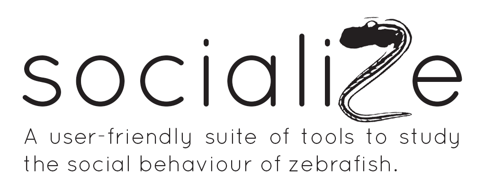

# socialiZe



## About

socialiZe provides behavioural neuroscientists with a toolkit to analyze social behaviour in zebrafish. It is a web application that allows users to *upload videos of zebrafish and analyze them using a variety of tools, or analyze them via a live videostream (will confirm this as the project progresses)*. The application is built using FastAPI, a Python framework for building APIs, and SvelteKit, a frontend framework for building web applications.

## Configuration

**For updated instructions, please see the [Installation](documentation/Installation.md) page.**

To configure socialiZe for development, you will first need to clone the repository:
```bash
git clone https://github.com/LinLabGithub/Social.git
```

Afterwards, open two terminal windows so we can configure the backend and frontend.

### Backend

1. Navigate to the `backend/` directory
    ```bash
    cd backend/
    ```

2. Create a virtual environment
    ```bash
    python3 -m venv venv
    ```

3. Activate the virtual environment
    ```bash
    source venv/bin/activate
    ```

4. Install the dependencies
    ```bash
    pip install -r requirements.txt
    ```

5. Run the backend
    ```bash
    uvicorn main:app --reload
    ```

### Frontend

1. Navigate to the `frontend/` directory
    ```bash
    cd frontend/
    ```

2. Install the dependencies
    ```bash
    npm install
    ```

3. Run the frontend
    ```bash
    npm run dev
    ```

